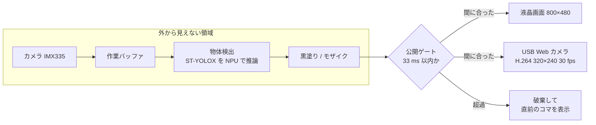

# Saframe

**映った人を、必ず隠してから映す。**

Saframe は、カメラに映った人物を隠し終えてから映像を外へ出す、プライバシー保護カメラです。
μT-Kernel 3.0 を搭載した STM32N6570-DK 上で動き、人物の検出から映像の加工まで、すべてボードの中で行います。

TRON プログラミングコンテスト 2026、RTOS アプリケーション部門の学生部門への応募作品です。チームはコンピュータクラブです。

## 特長

- **隠し終えた映像だけを出す**
  カメラの画像は外から見えない作業バッファに取り込みます。黒塗りかモザイクを終えたコマだけを公開します。加工前の映像を画面や USB へ渡す経路は、プログラムの中にありません。
- **間に合わないコマは捨てる**
  取り込みから隠し終えるまでに、30 fps の動画 1 コマ分にあたる 33 ミリ秒の制限時間を設けています。間に合わなかったコマは表示せず、直前の安全なコマを表示し続けます。
- **画面と USB Web カメラへ同時に出力**
  ボードの液晶画面に表示しながら、USB でつないだパソコンへ H.264 の Web カメラ映像として送ります。

## 仕組み



カメラは表示用と推論用の 2 系統の画像を 30 fps で連続して取り込みます。同じ瞬間に撮られた 2 枚だけを組にし、物体検出モデルで人物を探して、その領域を隠します。各バッファは「空き、取り込み中、取り込み済み、推論中、加工済み、表示または破棄」の順にしか状態を進めません。これにより、加工前のコマが表示されることを構造として防いでいます。設計の理由は [ADR 0006](docs/adr/0006-publish-only-sanitized-frames.md) にまとめています。

### μT-Kernel のタスク

| タスク | 優先度 | 役割 |
| --- | ---: | --- |
| 描画 | 3 | 黒塗り・モザイク、制限時間の判定、液晶画面の切り替え。USB 用の縮小コピーの間だけ優先度を 6 に下げる |
| 取り込み | 4 | カメラの 2 系統の画像を組にして後段へ渡す |
| 推論 | 5 | 物体検出モデルを NPU で実行し、人物の位置を求める |
| H.264 圧縮 | 7 | USB へ送る映像を VENC で圧縮する |
| USB | 8 | USB の通信処理。割込みからセマフォで起こされる |
| 監視・操作 | 12 | ボタンでの隠し方の切り替えと、1 秒ごとの計測値の出力 |

優先度は数値が小さいほど高くなります。バッファの受け渡しにはセマフォを、処理結果の共有には優先度継承つきのミューテックスを使っています。USB 側が遅れたり止まったりしても、液晶画面の更新は止まりません。

## 性能

STM32N6570-DK の実機で、T-Monitor に 1 秒ごとに出る計測値を集計した結果です。黒塗りとモザイク、USB 出力の有無を切り替えながら、映る人数も変えて約 20 分連続で動かしました。

- 約 36,000 コマを公開し、障害やカメラの停止は起きませんでした。
- 公開したコマの処理時間は最大 32,999 マイクロ秒で、すべて 33 ミリ秒の制限時間に収まっています。
- 物体検出モデルの推論時間は、どの条件でも約 13.2 ミリ秒です。

| 条件 | 公開 fps の平均 | 制限時間を超えて捨てた割合 |
| --- | ---: | ---: |
| 黒塗り | 30.3 | 0.07% |
| 黒塗りと USB 出力 | 29.8 | 1.2% |
| モザイク | 27.4 | 7.9% |
| モザイクと USB 出力 | 17.9 | 32% |

モザイクの処理時間は隠す面積に比例して延びます。映る人が 1 人なら捨てたコマは約 2% ですが、3 人になると半数を超えます。間に合わないコマは表示されず、画面は直前の安全なコマのまま止まります。加工前の映像は出ません。モザイク処理の高速化は今後の課題です。

## 必要なもの

- STM32N6570-DK と、付属の IMX335 カメラモジュール
- STM32CubeIDE と STM32CubeProgrammer
- USB Type-C ケーブル 2 本。デバッグ用の ST-LINK と、Web カメラ出力用の CN18 に使う
- USB 映像を見る場合は、H.264 を再生できるアプリ。Windows では FFmpeg の `ffplay`、Linux では VLC や guvcview

動作を確認した開発環境は、STM32CubeIDE 2.1.1、GNU Tools for STM32 14.3.rel1、STM32CubeProgrammer 2.22.0 です。

## ビルドと実行

1. STM32CubeIDE でこのリポジトリのルートを開き、`mtk3bsp2_stm32n657`、`mtk3bsp2_stm32n657_Appli`、`mtk3bsp2_stm32n657_FSBL` の 3 つのプロジェクトをインポートします。
2. Appli と FSBL を `Debug` 構成でビルドします。
3. ボードを Development mode にし、モデルの重みを外部フラッシュへ一度だけ書き込みます。

   ```bash
   export STM32N6_LOADER="<STM32CubeProgrammer>/bin/ExternalLoader/MX66UW1G45G_STM32N6570-DK.stldr"
   STM32_Programmer_CLI -c port=SWD mode=HOTPLUG -el "$STM32N6_LOADER" -hardRst \
     -w Appli/FaceDetection/Model/network_data.hex
   ```

4. `Appli/mtk3bsp2_stm32n657_Appli Debug.launch` でデバッグを開始し、`usermain` で止まったら実行を再開します。
5. ST-LINK の仮想 COM ポートを 115200 bps、8-N-1 で開くと、T-Monitor に計測値が 1 秒ごとに出力されます。

### 使い方

- 人物がカメラに映ると、液晶画面では隠された状態で表示されます。
- 青いユーザーボタン B2 を押すと、黒塗りとモザイクが切り替わります。
- CN18 とパソコンをつなぐと、パソコンからは Web カメラとして見えます。Windows では次のように再生します。デバイス名は `ffmpeg -list_devices true -f dshow -i dummy` で確認してください。

  ```bash
  ffplay -f dshow -i video="STM32 uvc"
  ```

  映像は H.264 のみです。MJPEG にしか対応しないアプリ、たとえば Windows 標準のカメラアプリでは表示できません。

## テスト

ハードウェアに依存しない部分は、パソコン上で試験できます。

| 試験 | 対象 |
| --- | --- |
| `tests/privacy_filter_test.c` | 黒塗りとモザイクの境界処理、33 ms の公開判定 |
| `tests/camera_capture_stream_test.c` | 連続取り込みのバッファ切り替えと、2 系統の画像の組み合わせ |
| `tests/privacy_pipeline_queue_test.c` | タスク間のキュー |
| `tests/usb_webcam_conversion_test.c` | USB 用の中央切り出しと縮小 |
| `tests/test_*.py` | モデル取り込み時の検査と、学習用スクリプト |

ビルドと実行のコマンドは [README_OBJECT_DETECTION.md](README_OBJECT_DETECTION.md) にあります。

## ディレクトリ構成

| パス | 内容 |
| --- | --- |
| `Appli/` | μT-Kernel とアプリケーション本体のイメージ |
| `Appli/FaceDetection/` | カメラ、推論、公開ゲート、USB 出力のソースとモデル。ディレクトリ名は顔検出版の名残 |
| `FSBL/` | ボード起動時に最初に動くブートローダ |
| `modelzoo/` | STM32 AI Model Zoo でモデルを生成するための設定と、モデルの検査条件 |
| `tools/` | モデルの取り込みと検査、推論ランタイムの同期、学習用のスクリプト |
| `tests/` | パソコン上で動く試験 |
| `docs/adr/` | 設計判断の記録 |
| `hello_world/` | μT-Kernel が STM32N6570-DK で起動することを確かめた最小構成 |

## ドキュメント

- [README_OBJECT_DETECTION.md](README_OBJECT_DETECTION.md): 詳しい構成、モデルの差し替え手順、T-Monitor の計測項目
- [docs/adr/](docs/adr/): 設計判断の記録。特に 0006 公開ゲート、0007 モデルの選定、0008 USB 出力
- [CONTEXT.md](CONTEXT.md): このリポジトリで使う用語
- [modelzoo/README_PROXY_3CLASS.md](modelzoo/README_PROXY_3CLASS.md): 顔・書類・ロゴの 3 クラスに向けた学習手順
- [README_FACE_DETECTION.md](README_FACE_DETECTION.md): 最初に作った顔検出版の記録

## ライセンス

Saframe のために書いたコードと文書は [MIT License](LICENSE) で公開しています。
リポジトリに取り込んだ既存ソフトウェアには、それぞれのライセンスが適用されます。

## 使用している既存ソフトウェア

μT-Kernel 3.0 と BSP2 は TRON Forum が T-License 2.2 で配布しているものを使っています。
このほか、STMicroelectronics の STM32CubeN6 HAL、STM32N6 のサンプル、STM32 AI Model Zoo の学習済みモデル、UVC ライブラリ、H.264 エンコーダを取り込んでいます。
入手先、固定したバージョン、著作権者、ライセンスは [THIRD_PARTY_NOTICES.md](THIRD_PARTY_NOTICES.md) に記載しています。
